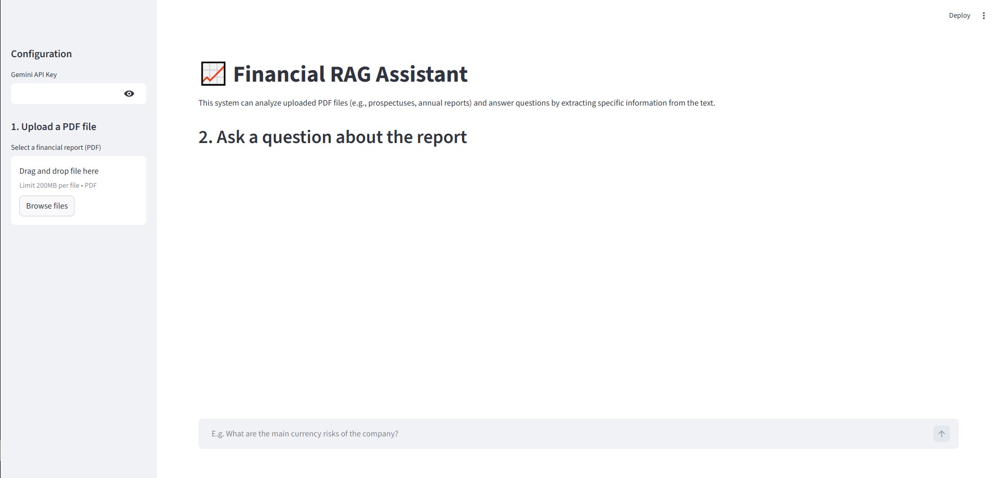

# 📈 Financial RAG Assistant

AI Assistant for analyzing financial reports (e.g., IPO prospectuses, annual reports). This project demonstrates the usage of Retrieval-Augmented Generation (RAG) to extract specific financial numbers, risks, and insights from multipage PDF documents using LangChain, FAISS, and Google Gemini.


## 🚀 Features
- **PDF Ingestion**: Handles large PDF files, splitting them into manageable chunks to respect LLM token limits.
- **Vector Database**: Uses locally-stored **FAISS** for fast similarity search of document contents.
- **RAG Pipeline**: Retrieves the most relevant context and answers complex financial queries based *only* on the provided document.
- **Interactive UI**: Clean, easy-to-use web interface built with **Streamlit** for portfolio presentation.
- **Built-in Rate Limiting**: Aggressively handles Free Tier API limits (Quota Exceeded) via micro-batching during database creation.

## 🛠️ Stack & Technologies
- **Python 3.12** (Strictly recommended to avoid C-extension conflicts with older/newer Python versions).
- **LangChain & langchain-google-genai==1.0.8** (Downgraded integration to bypass routing bugs in v2.0+).
- **FAISS** (Local Vector Database for CPU).
- **Google Generative AI - Gemini**: 
  - **LLM**: `gemini-2.5-flash` (Current primary model as of 2026, replacing the deprecated 1.5 versions).
  - **Embeddings**: `gemini-embedding-001` (Current standard model, bypassing the deprecated `text-embedding-004`).
- **Streamlit** (Frontend)

## 💻 Local Setup & Installation

1. **Clone or locate this project folder.**
   Navigate to the project directory in your terminal.

2. **Create and activate a virtual environment.**
   ```bash
   python -3.12 -m venv venv312
   # Windows
   .\venv312\Scripts\activate
   # macOS/Linux
   source venv312/bin/activate
   ```

3. **Install dependencies.**
   ```bash
   pip install -r requirements.txt
   ```

4. **Set your API Key.**
   Edit the `.env` file and replace the placeholder with your **Google Gemini API Key**:
   ```env
   GOOGLE_API_KEY="AIzaSy...your...key...here"
   ```
   *(You can also provide it directly in the UI later without modifying the `.env`)*

## 🏃‍♂️ Running the Project

1. Start the Streamlit application:
   ```bash
   streamlit run app.py
   ```
2. The application will automatically open in your default web browser (usually at `http://localhost:8501`).
3. Follow the instructions on the left sidebar:
   - Provide your API key if you haven't in the `.env` file.
   - Upload a PDF financial report.
   - Click "Analyze document", wait for the FAISS database to be built.
   - Start chatting and asking detailed financial questions!

## 🕵️‍♂️ Usage Example
* User: "What are the main currency risks indicated in the report and how did they affect the Q3 margin?"
* System: *(Retrieves specific paragraphs related to FX risk from the report and gives a concise, accurate answer based strictly on the uploaded PDF).*

## 🛑 Troubleshooting & Known Issues
During development, several critical environment and API restrictions were handled natively in the code:
* **404 NOT_FOUND on Embeddings / Generation**: Google deprecated older models like `text-embedding-004` and `gemini-1.5` in early 2026. The backend explicitly calls the modern `gemini-embedding-001` and `gemini-2.5-flash` standards to prevent missing route APIs. Furthermore, `langchain-google-genai` is pinned to `1.0.8` to mitigate a known 404 URL parsing bug introduced in GenAI `>=2.0.0`.
* **429 RESOURCE_EXHAUSTED (Quota Exceeded)**: The Gemini Free Tier extremely limits Requests Per Minute (RPM). `ingest.py` avoids application freezing by ingesting documents in very slow micro-batches (5 chunks at a time with 15-second sleep intervals) natively evading the aggressive 15 RPM limits of Google's free-tier infrastructure.
* **Pydantic/Ide errors (Red squiggles)**: This project relies on a stable **Python 3.12** virtual environment instead of the experimental 3.14 to ensure flawless compatibility with library C-extensions like FAISS.
